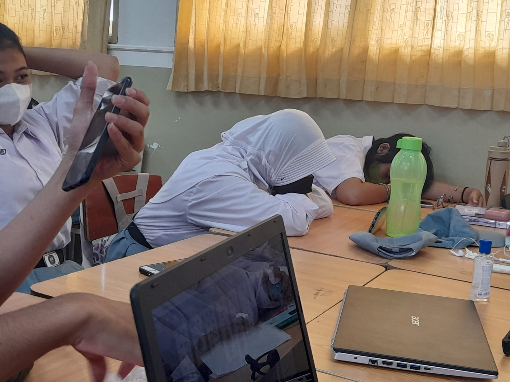

# Web-pkwu
<!DOCTYPE html>
<html>
<head>
<title>Blog Kelompok</title>
<meta charset="UTF-8">
<meta name="viewport" content="width=device-width, initial-scale=1">
<link rel="stylesheet" href="https://www.w3schools.com/w3css/4/w3.css">
<link rel="stylesheet" href="https://fonts.googleapis.com/css?family=Raleway">

</head>
<body class="w3-light-grey">

<!-- w3-content defines a container for fixed size centered content, 
and is wrapped around the whole page content, except for the footer in this example -->

<!-- Header -->
<header class="w3-container w3-center w3-padding-32"> 
  <h1><b>Blog Kelompok PKWU</b></h1>
  
Selamat Datang Di Blog PKWU

</header>

<!-- Grid -->

<!-- Blog entries -->

  <!-- Blog entry -->
  

    
    

      <h3><b>Anak No life x-4</b></h3>
      Lahir, 23 agustus 2006
    

    

      
Fahmi Husaini adalah seorang ketua kelas x-4 tetapi dia adalah anak kesayangan dari romo/ishak botak

      

    

  

  

  <!-- Blog entry -->
  

  
    

      <h3><b>Chairul</b></h3>
      Lahir, 22 juli 2006
    

    

      
Chairul adalah anak yang sangat malas di kelompok ini meskipun begitu dia adalah tipe orang pekerja karena memiliki badan yang bagus untuk menjadi kuli bangunan

      

        

        

      

    

  

  
  

  
    

      <h3><b>Bandar Terkenal</b></h3>
      Lahir, 16 april 2007
    

    

      
Zahrandanu telah ditangkap sejak tahun 2018 dan dikenakan hukuman penjara 100 tahun karena telah melanggar pasal 115 ayat 2 bagian c dan terancam hukuman mati

      

        

        

      

    

  

  

  
    

      <h3><b>Alya</b></h3>
      Lahir, 22 agustus 2006
    

    

      
Alya adalah istri dari Zahrandanu yang terkenal bandar dan cabul

      

        

        

      

    

  

  

  
    

      <h3><b>Moira</b></h3>
      Lahir, 22 mei 2007
    

    

      
Moira adalah

      

        

        

      

    

  

  

  
    

      <h3><b>Tiyas</b></h3>
      Lahir, 8 desember 2006
    

    

      
Tiyas adalah seorang anak terlantar yang ditemukan oleh romo dan dimasukkan ke sekolah Hang Tuah 1 oleh kedua orang tuanya

      

        

        

      

    

  

  

  
    

      <h3><b>Vanesya</b></h3>
      Lahir, 26 mei 2007
    

    

      
Vanesya adalah anak dari kedua orang tuanya yang dilahirkan di atas kasur di rumah sakit

      

        

        

      

    

  

  

  
    

      <h3><b></b></h3>
      Lahir, 5 maret 2007
    

    

      
Amanda adalah seorang anak yang ambisius, tetapi dia terlalu suka bermain dengan temannya

      

        

        

      

    

  

  
<!-- END BLOG ENTRIES -->

<!-- Introduction menu -->

  <!-- About Card -->
  

  
    

      <h4><b>Tentang Kami</b></h4>
      
Kami adalah kelompok yang terbentuk dari beberapa bulan yang lalu, tetapi kami sudah sangat kompak satu sama lain, sehingga dapat menyelsaikan pekerjaan dengan mudah

      
Ini adalah kelompok favorit kami diantara kelompok yang ada di matapelajaran yang lain

    

  

  
  <!-- Posts -->
  
 
  <!-- Labels / tags -->
  

    

      <h4>Tags</h4>
    

    

    

       <button class="w3-tag w3-light-grey w3-small w3-margin-bottom">Fauzan</button> 
       <button class="w3-tag w3-light-grey w3-small w3-margin-bottom">Moira</button>
       <button class="w3-tag w3-light-grey w3-small w3-margin-bottom">Zahrandanu</button> 
       <button class="w3-tag w3-light-grey w3-small w3-margin-bottom">Alya</button>
       <button class="w3-tag w3-light-grey w3-small w3-margin-bottom">Fahmi</button>
       <button class="w3-tag w3-light-grey w3-small w3-margin-bottom">Gendis</button> 
       <button class="w3-tag w3-light-grey w3-small w3-margin-bottom">Chairul</button> 
       <button class="w3-tag w3-light-grey w3-small w3-margin-bottom">Hasya</button>
       <button class="w3-tag w3-light-grey w3-small w3-margin-bottom">Tiyas</button> 
       <button class="w3-tag w3-light-grey w3-small w3-margin-bottom">Vanesya</button> 
    

    

  

  
<!-- END Introduction Menu -->

<!-- END GRID -->

 

<!-- END w3-content -->

<!-- Footer -->
<footer class="w3-container w3-dark-grey w3-padding-32 w3-margin-top">
  
@Copyright 2022

</footer>

</body>
</html>
